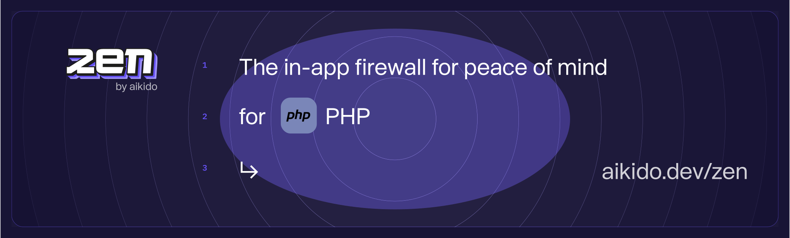

# Zen, in-app firewall for PHP | by Aikido

Zen, your in-app firewall for peace of mind– at runtime.

Zen is an embedded Web Application Firewall that autonomously protects your apps against attacks and provides advanced access controls features.

Zen protects your PHP apps by blocking malicious user input that could lead to security vulnerabilities. It guards against SQL injections, command injections, path traversal attacks, and more. Running directly on your PHP app's server, it offers seamless installation and low maintenance.

## Features

Zen will autonomously protect your PHP applications from the inside against:

* 🛡️ [SQL injection attacks](https://www.aikido.dev/blog/the-state-of-sql-injections)
* 🛡️ [Command injection attacks](https://www.aikido.dev/blog/command-injection-in-2024-unpacked)
* 🛡️ [Path traversal attacks](https://owasp.org/www-community/attacks/Path_Traversal)
* 🛡️ [Server-side request forgery (SSRF)](./docs/ssrf.md)
* 🛡️ [Attack wave detection](https://help.aikido.dev/zen-firewall/zen-features/attack-wave-protection)

Zen operates autonomously on the same server as your PHP app to:

* ✅ Secure your app like a classic web application firewall (WAF), but with none of the infrastructure or cost.
* ✅ Rate limit specific API endpoints by IP or by user
* ✅ Allow you to block specific users manually
