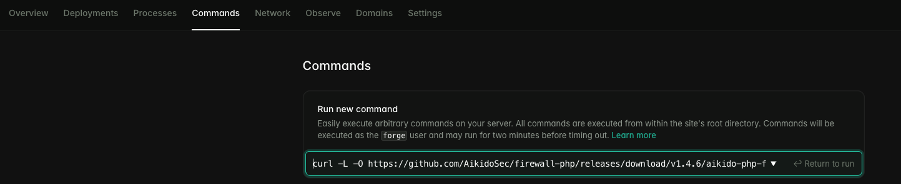

# Laravel Forge

In Forge, go to your server -> `Settings` -> `Environment` and add the `AIKIDO_TOKEN` in the .env file.


You can get your token from the [Aikido Security Dashboard](https://help.aikido.dev/doc/creating-an-aikido-zen-firewall-token/doc6vRJNzC4u).

Go to "Commands" and run the following by replacing the sudo password with the one that Forge displays when the server is created:
```
curl -L -O https://github.com/AikidoSec/firewall-php/releases/download/v1.4.15/aikido-php-firewall.x86_64.deb && echo "YOUR_SUDO_PASSWORD_HERE" | sudo -S dpkg -i -E ./aikido-php-firewall.x86_64.deb && echo "YOUR_SUDO_PASSWORD_HERE" | sudo -S service php8.4-fpm restart
```



Alternatively, you can execute the same command directly from the Forge terminal.


